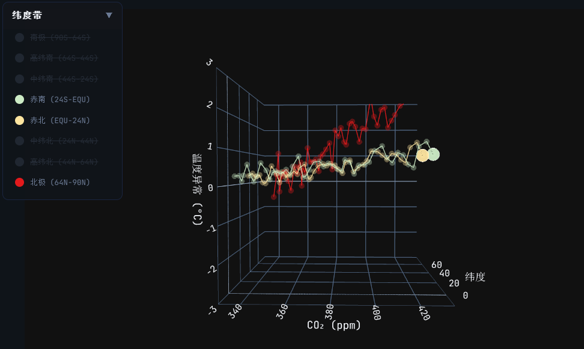
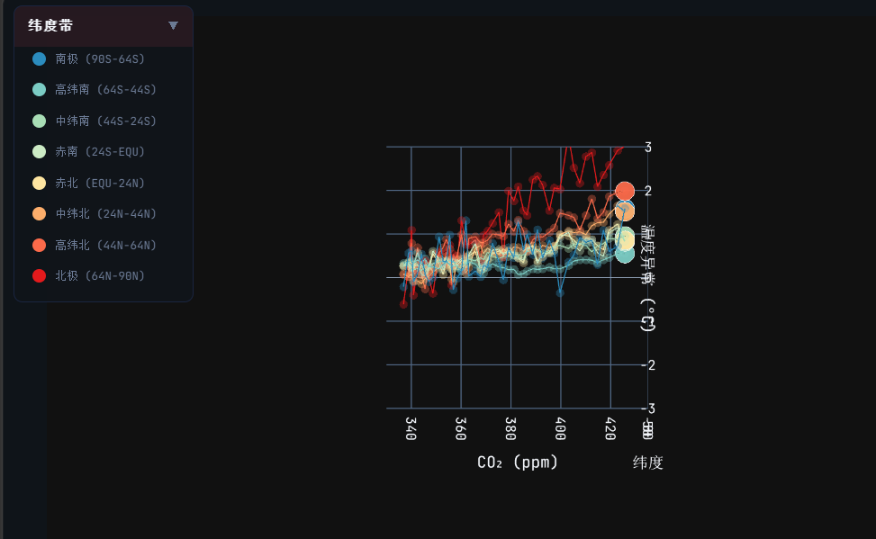
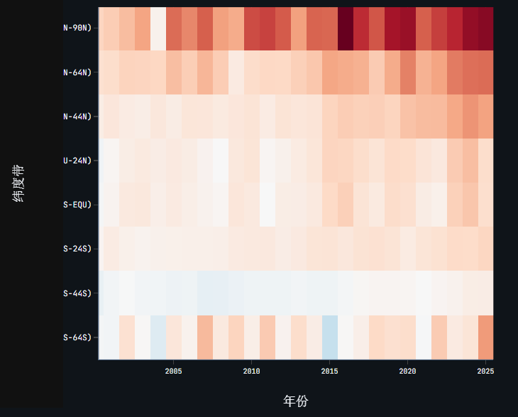
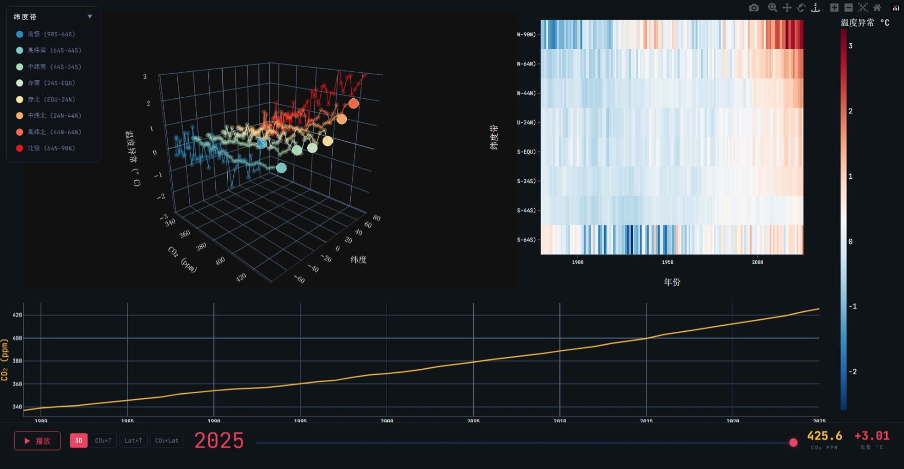
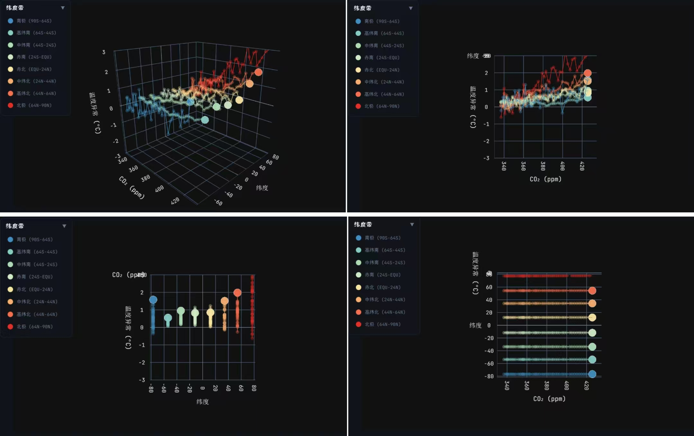

## 全球气候演变 3D 交互可视化：CO₂ 浓度、纬度与温度异常的关系探究（1880–2025）

###### 公开访问 URL
https://stu-vad.github.io/Final-Assignment/

###### 小组成员与贡献

| 姓名 | 主要贡献 | 占比 |
|------|------|------|
| ⻩应辉 | 统筹，代码优化重构，⼯作流修改，汇报 | 24.5% |
| 钱俊企 | 实现可视化原型，完成原型的所有交互 | 20% |
| 李舒达 | 增强与优化已有功能，实现图例组件，添加变化趋势线 | 14.5% |
| 罗展彬 | 参与设计讨论，报告制作 | 10.5% |
| 李芝轩 | 参与设计讨论，PPT制作 | 10.5% |
| 郑逸驰 | 参与设计讨论 | 5% |
| 何键韬 | 参与设计讨论 | 5% |
| 孙海骏 | 参与设计讨论 | 5% |

---

### 1. 动机与目标

全球变暖已成为公众熟知的结论，但其中几个关键事实难以通过传统二维图表充分表达：北极升温速度是赤道地区的 3–4 倍（极地放大效应），不同纬度对 CO₂ 升高的响应强度差异显著，极端异常年份具有明显的空间衰减特征。这些问题涉及 CO₂、纬度、温度三个维度的耦合关系，需要三维可视化来呈现完整结构。

本项目构建了一个交互式 3D 气候仪表板，围绕三个核心问题展开：

- **Q1**：不同纬度带的升温速度差异有多大？
- **Q2**：CO₂ 与各纬度带温度变化有怎样的相关结构？
- **Q3**：极端异常年份在空间上有何特征？

**目标用户**：气候/可视化课程学生（将理论概念落地为可探索的数据）、对气候变化感兴趣的公众（通过交互自主验证结论）、科普教师（需要直观的演示工具）。界面以中文为主，交互设计力求直觉化，无需专业背景即可使用。

---

### 2. 数据

本项目使用两个公开数据集，以年份为主键做左连接：

**CO₂ 年均浓度数据**（NOAA Global Monitoring Laboratory）：覆盖 1979–2025 年，共 47 条记录。字段包括年份（year）、年均 CO₂ 摩尔分数（mean，单位 ppm）和不确定度（unc）。CO₂ 浓度从 336.85 ppm（1979）上升至 425.65 ppm（2025）。

**纬度带温度异常数据**（NASA GISTEMP v4）：覆盖 1880–2025 年，共 146 条记录。基于 1951–1980 年平均值计算温度异常，按 8 个纬度带分别记录：

| 纬度带 | 范围 | 中点纬度 |
|--------|------|---------|
| 南极 | 90S–64S | −77° |
| 南高纬 | 64S–44S | −54° |
| 南中纬 | 44S–24S | −34° |
| 南近赤道 | 24S–EQU | −12° |
| 北近赤道 | EQU–24N | +12° |
| 北中纬 | 24N–44N | +34° |
| 北高纬 | 44N–64N | +54° |
| 北极 | 64N–90N | +77° |

按 Munzner 框架抽象，各属性类型为：

- **年份**：quantitative（interval）——等距有顺序，无绝对零点
- **CO₂ 浓度**：quantitative（ratio）——等距有顺序，有绝对零点
- **温度异常**：quantitative（diverging）——有正值有负值，零点有语义（基准期均值）
- **纬度带**：categorical（ordered）——从南极到北极有天然空间顺序

数据经 Python 脚本预处理，将 CSV 转为 JSON 格式供前端加载。温度数据 melt 为长表格式（146 年 × 8 带 = 1168 行）。CO₂ 在 1979 年前为空值，因此 3D 散点仅覆盖 1979–2025（47 年 × 8 带 = 376 个数据点）。

---

### 3. 分析任务

按 Munzner 框架的 Why 层定义以下 6 个分析任务：

| 任务 | Munzner 分类 | 描述 |
|------|-------------|------|
| T1 Discover | 发现分布 | 探索 CO₂-温度-纬度的三维分布与演变趋势 |
| T2 Compare | 对比差异 | 比较不同纬度带的升温模式与响应差异 |
| T3 Identify | 识别异常 | 识别极端温度异常年份和异常纬度带 |
| T4 Browse | 浏览 | 浏览任意年份的温度空间分布模式 |
| T5 Locate | 定位 | 定位升温超过阈值的时间点 |
| T6 Summarize | 总结 | 观察十年际温度变化趋势 |

T1–T3 为核心任务，直接对应三个研究问题。T4 支持探索式假设生成，T5–T6 支持结论验证。各任务通过不同的可视化组件和交互手段支持：T1/T4 通过年份滑块和播放动画支持，T2 通过趋势线静态对比和图例过滤支持，T3/T6 通过热力图全局视图支持，T5 通过 CO₂ 时序图支持。

---

### 4. 可视化设计

#### 4.1 视觉编码

编码的核心挑战是四个属性（CO₂、纬度、温度、年份）需要同时呈现。按 Munzner 的通道有效性排序，空间位置 > 颜色 > 尺寸 > 形状 [4]。因此：

| 组件 | Mark | 属性→通道映射 | 说明 |
|------|------|-------------|------|
| 3D 散点图 | Point | CO₂→X, 纬度→Y, 温度→Z, 纬度带→颜色(冗余) | 核心交互视图 |
| 趋势线 | Line | 按 CO₂-纬度-温度坐标连线，颜色编码纬度带 | 静态展示历史轨迹 |
| 温度热力图 | Area | 年份→X, 纬度→Y, 温度→颜色 | 全局概览视图 |
| CO₂ 时序图 | Line + Area | 年份→X, CO₂→Y, 不确定度→阴影带 | 时间趋势上下文 |

三个核心定量变量（CO₂、纬度、温度）被分配到 X/Y/Z 空间位置——这是人眼可分辨的最高精度通道 [4][5]。纬度带额外映射到颜色通道，与 Y 轴位置形成冗余编码——3D 旋转时 Y 轴位置会产生透视变形，分类颜色提供了不受投影影响的识别手段。年份通过动画帧序列与趋势线共同表达。

#### 4.2 设计理念

**发散色板而非彩虹色。** 温度异常是 diverging 类型（有正有负），热力图采用蓝-白-红自定义发散色阶，零值映射为白色中点。Borland & Taylor [2] 指出彩虹色阶存在感知非线性、人为边界和色觉障碍不友好三个缺陷；发散色阶满足感知线性度、语义直观（红=热、蓝=冷）且对色觉障碍友好。

**趋势线弥补动画局限。** Tversky et al. [7] 指出动画不利于精确比较——用户难以同时追踪多个运动对象。趋势线将每个纬度带的历史轨迹静态化，在静止状态下即可呈现升温斜率的纬度差异，与动画形成互补。

**Overview-first 多视图布局。** 遵循 Shneiderman [6] 的 "Overview first, zoom and filter, then details-on-demand" 原则：热力图提供 1880–2025 全时段概览（overview），3D 散点提供单年细节（detail + filter），CO₂ 时序提供趋势上下文（context）。用户在热力图中定位异常年份，再到 3D 视图中观察其空间结构。

**暗色主题。** 暗色背景下发散色板的蓝-白-红对比度更高，温度异常的细微差异更容易区分，同时减少长时间探索时的眼部疲劳。

**纬度 Y 轴排序。** 从南极到北极自下而上排列，利用"上北下南"的地图认知心理模型，降低认知门槛。

---

### 5. 分析发现

**发现一：极地放大效应确认。** 北极温度异常从 1880 年代约 −1.1°C 飙升至 2025 年的 **+3.01°C**，同期全球平均仅升至 **+1.19°C**。升温幅度远超赤道地区，且仍在加速。3D 散点图中北极带的趋势线斜率明显陡于赤道带，极地放大效应一目了然。

*图 1：3D 散点图侧视图，清晰展示北极（红色趋势线）与赤道（黄色趋势线）的升温斜率差异。*

**发现二：CO₂ 敏感性存在显著纬度梯度。** CO₂ 从 336.85 ppm 升至 425.65 ppm（+89 ppm），但北极温度异常从约 −0.6°C 升至 +3.01°C，赤道带仅从约 +0.3°C 升至 +0.9°C。这意味着全球平均升温数字严重低估了极地地区的实际升温幅度。

*图 2：CO₂×T 正交投影视角，X 轴为 CO₂，Y 轴为温度，清晰展示各纬度带的 CO₂-温度相关结构。*

**发现三：极端年份呈现空间衰减模式。** 热力图上 2016、2023、2024 等异常年呈现"红色脉冲"从极地向赤道衰减的模式。2016 年北极达 **+3.26°C**（历史最高，强厄尔尼诺叠加），甚至超过 2025 年的 +3.01°C。

*图 3：热力图局部放大，展示 2016、2023、2024 年的"红色脉冲"从极地向赤道衰减的空间模式。*

**发现四：南北半球升温不对称。** 高纬北（44N–64N）2025 年异常 +1.99°C，对应高纬南（64S–44S）仅 +0.56°C。这种不对称可能与北半球更大的陆地面积有关——陆地比热容低于海洋，升温响应更快。

以上发现均通过 3D 散点图和热力图的交互探索得到验证，三个核心研究问题均得到明确回答。

---

### 6. 网页使用指南

*图 4：系统全景视图。左侧为 3D 散点图（年份滑块在 2025），右上角为温度热力图（1880–2025 全时段），底部为 CO₂ 时序图（1979–2025）。*

本系统是一个多视图交互式仪表板，由三个面板组成：

---

#### 6.1 左侧主面板 — 3D 散点图

核心交互视图。每个数据点代表某年某纬度带的一次观测。

**交互功能表：**

| 功能 | 操作方式 | 作用 |
|:------|:---------|:------|
| **年份滑块** | 拖动底部滑块选择年份（1979–2025） | 逐步浏览不同年份的三维数据 |
| **播放/暂停** | 点击播放按钮 ▶ | 自动从当前年份逐年推进至 2025 |
| **3D 旋转缩放** | 鼠标拖拽旋转，滚轮缩放 | 从不同角度观察三维结构 |
| **悬停查看** | 鼠标悬停在数据点上 | 显示纬度带名、年份、CO₂ 浓度、温度异常 |
| **预设视角** | 点击 "3D" / "CO₂×T" / "Lat×T" / "CO₂×Lat" 按钮 | 快速切换到三维全景或三个正交投影视角 |
| **图例过滤** | 点击左上角图例中的纬度带名称 | 显示/隐藏该纬度带的数据 |
| **双击重置** | 在预设视角模式下双击图表区域 | 回到三维全景视角 |

*图 5：四种预设视角模式。从左到右：3D 全景、CO₂×T（侧视图）、Lat×T（正视图）、CO₂×Lat（俯视图）。*

---

#### 6.2 右上角 — 温度热力图

静态概览视图，展示 **1880–2025 年** 所有 8 个纬度带的温度异常色块。

- **X 轴**：年份
- **Y 轴**：纬度带
- **颜色**：温度偏离基准期的程度（蓝=偏冷，白=基准，红=偏暖）

该视图不受年份滑块影响，始终显示完整历史，可清晰观察到 2016、2023、2024 年等异常年呈现"红色脉冲"从极地向赤道衰减的空间模式。

---

#### 6.3 底部 — CO₂ 时序图

静态趋势视图，展示 **1979–2025 年** 全球年均 CO₂ 浓度的变化趋势。

- 金色曲线：年均 CO₂ 浓度均值
- 浅色阴影带：不确定度范围

该视图展示近几十年 CO₂ 浓度持续加速上升的趋势。

---

#### 6.4 控制栏信息

底部控制栏实时显示：
- **当前年份**
- **CO₂ 浓度值**
- **北极温度异常值**

---

### 7. 用户研究

邀请 3 名用户使用可视化系统完成两个探索任务：(1) 在 3D 散点图中找出北极最热年份；(2) 在热力图中对比 1990 年代与 2020 年代的温差。观察操作过程后进行简短访谈。

**优点**：所有用户均顺利完成两个任务。热力图被评为最直观的视图，无需学习即可理解。3D 散点图的播放动画获得一致好评，用户反馈"能清晰看到北极点的运动轨迹"。

**不足**：一名用户未理解发散色板零点含义（白色代表基准期），建议在色标旁标注基准期说明。

---

### 8. 局限性

1. **CO₂ 无纬度分解**：同年所有纬度带共享相同 X 坐标。可引入格点化 CO₂ 数据（如 CarbonTracker）为各纬度带提供差异化 X 值。
2. **3D 遮挡**：虽已通过分类颜色、趋势线和正交投影视角缓解，但仍需用户主动切换视角。
3. **空间分辨率有限**：8 个纬度带无法展示带内经度差异，可采用 GISTEMP 格点级数据。
4. **色阶范围固定**：固定 ±3.0°C 范围，2016 年北极异常 +3.26°C 超出色阶上限，极端值之间无法通过颜色区分。

---

### 9. 参考文献

1. Munzner, T. (2014). *Visualization Analysis and Design*. CRC Press.
2. Borland, D., & Taylor II, R. M. (2007). Rainbow Color Map (Still) Considered Harmful. *IEEE Computer Graphics and Applications*, 27(2), 14–17.
3. Heer, J., Bostock, M., & Ogievetsky, V. (2010). A Tour Through the Visualization Zoo. *Communications of the ACM*, 53(6), 59–67.
4. Mackinlay, J. (1986). Automating the Design of Graphical Presentations of Relational Information. *ACM Transactions on Graphics*, 5(2), 110–141.
5. Cleveland, W. S., & McGill, R. (1984). Graphical Perception: Theory, Experimentation, and Application to the Development of Graphical Methods. *Journal of the American Statistical Association*, 79(387), 531–554.
6. Shneiderman, B. (1996). The Eyes Have It: A Task by Data Type Taxonomy for Information Visualizations. *Proceedings of the 1996 IEEE Symposium on Visual Languages*, 336–343.
7. Tversky, B., Morrison, J. B., & Bétrancourt, M. (2002). Animation: Can It Facilitate? *International Journal of Human-Computer Studies*, 57(4), 247–262.
8. NOAA Global Monitoring Laboratory. (2025). *Globally averaged marine surface annual mean CO₂ data*. https://gml.noaa.gov/ccgg/trends/gl_data.html
9. NASA Goddard Institute for Space Studies. (2025). *GISS Surface Temperature Analysis (GISTEMP v4)*. https://data.giss.nasa.gov/gistemp/

